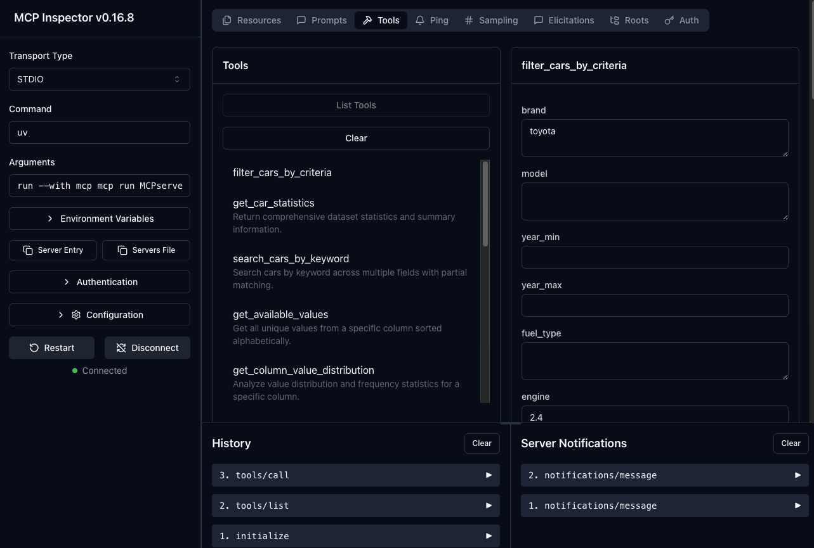
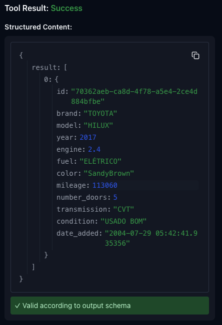

# 🚀 MCP Car Database System

<!-- A comprehensive Model Context Protocol (MCP) implementation for car database management with AI agent integration, testing framework, and performance analysis tools. -->
An MCP implementation with seamless Ollama agent integration, tool-based query handling, testing, and performance analysis — demonstrated on a car database.

## 📋 Table of Contents

- [Overview](#overview)
- [Prerequisites](#prerequisites)
- [Installation](#installation)
- [Components](#components)
- [Data Generation](#data-generation)
- [MCP Server Setup](#mcp-server-setup)
- [AI Agent/Client Usage](#ai-agentclient-usage)
- [Testing Framework](#testing-framework)
- [Performance Analysis](#performance-analysis)
- [Examples](#examples)
- [Troubleshooting](#troubleshooting)

## 🎯 Overview

This project implements a complete MCP ecosystem for car database operations, featuring:

- **Data Generation**: Synthetic car data creation with realistic attributes
- **MCP Server**: FastMCP-based server with 15+ specialized car database tools
- **AI Agent Client**: Ollama-powered client with tool integration
- **Testing Suite**: Comprehensive test framework with multi-model comparison
- **Performance Analysis**: Automated report generation from test results

## 🔧 Prerequisites

### Required Software
- Python 3.8+
- [Ollama](https://ollama.ai/) installed and running
- Pandas, FastMCP, and other Python dependencies

### Ollama Models
Install the following models for testing:
```bash
ollama pull llama3.2:latest
ollama pull qwen3-coder:480b-cloud
ollama pull gpt-oss:20b-cloud
ollama pull gemma:2b
```

## 📦 Installation

1. **Clone and setup environment:**
```bash
git clone https://github.com/pcumino/desafio_mcp
cd desafio_mcp
pip install -r requirements.txt  # or use uv/poetry
```

2. **Start Ollama service:**
```bash
ollama serve
```

3. **Verify installation:**
```bash
python MCPserver.py --help
python OllamaClient.py --help
```

## 🏗️ Components

### 1. Data Generation (`dataFaker.py`)

Generates synthetic car database with realistic Brazilian car market data.

**Features:**
- 10 major car brands (Volkswagen, Chevrolet, Fiat, etc.)
- Brand-specific models
- Realistic attributes (year, mileage, fuel type, condition)
- Configurable sample size and output format

### 2. MCP Server (`MCPserver.py`)

FastMCP-based server providing specialized car database tools.

**Available Tools:**
- `filter_cars_by_criteria` - Multi-criteria filtering
- `get_car_statistics` - Dataset statistics
- `search_cars_by_keyword` - Keyword search
- `get_available_values` - Column unique values
- `get_column_value_distribution` - Value frequency analysis
- `get_cars_sorted_by` - Sorting operations
- `get_cars_count_by_brand` - Brand counting
- `check_value_exists` - Value existence checking
- `get_grouped_statistics` - Grouped aggregations
- `filter_cars_by_date_range` - Date filtering
- And more...

### 3. AI Agent Client (`OllamaClient.py`)

Ollama-powered client with MCP tool integration following OpenAI patterns.

**Features:**
- OpenAI-style tool calling
- Multiple model support
- Interactive and batch modes
- Automatic tool selection and chaining
- Error handling and fallback mechanisms

### 4. Testing Framework (`test_questions_tools.py`)

Comprehensive testing suite for evaluating AI model performance with MCP tools.

**Test Categories:**
- **Basics**: Simple queries (brand counting, existence checks)
- **Intermediates**: Filtered searches (fuel type, transmission)
- **Advanced**: Statistical operations and summaries
- **Complex**: Multi-step operations requiring tool chaining

### 5. Performance Analysis (`json_to_markdown.py`)

Automated report generation from test results with detailed insights.

**Report Sections:**
- Executive summary with key metrics
- Model performance comparison table
- Question failure analysis
- Category-wise breakdown
- Detailed insights and recommendations
- Technical appendix

## 🎲 Data Generation

### Basic Usage

Generate a dataset with 1000 car records:

```bash
python dataFaker.py 1000
```

### Advanced Options

```bash
# Custom output file and language
python dataFaker.py 5000 --output custom_cars.csv --lang pt_BR

# Generate smaller dataset for testing
python dataFaker.py 100 --output test_cars.csv
```

### Generated Data Structure

| Column | Description | Example Values |
|--------|-------------|----------------|
| `id` | Unique identifier | UUID4 |
| `brand` | Car brand | VOLKSWAGEN, TOYOTA |
| `model` | Car model | GOL, COROLLA |
| `year` | Manufacturing year | 2000-2025 |
| `engine` | Engine size | 1.0, 1.6, 2.0 |
| `fuel` | Fuel type | FLEX, GASOLINA, HÍBRIDO |
| `color` | Car color | Various colors |
| `mileage` | Kilometers driven | 0-200,000 |
| `number_doors` | Door count | 2, 4, 5 |
| `transmission` | Transmission type | MANUAL, AUTOMÁTICA |
| `condition` | Car condition | NOVO, SEMINOVO, USADO |
| `date_added` | Registration date | Timestamp |

## 🖥️ MCP Server Setup

### Start the Server

```bash
python MCPserver.py
```

The server runs on stdio transport and automatically loads the car dataset from `data/cars.csv`.

### Server Configuration

- **Data Source**: `data/cars.csv` (configurable in script)
- **Transport**: stdio (standard for MCP)
- **Tools**: 15+ specialized car database operations

### Testing Server Tools

```python
# Example: Test individual tools
from MCPserver import filter_cars_by_criteria, get_car_statistics

# Filter Toyota cars from 2020-2022
toyota_cars = filter_cars_by_criteria(brand="Toyota", year_min=2020, year_max=2022)

# Get dataset statistics
stats = get_car_statistics()
```

### Testing Server Tools (web UI)
```bash
uv run mcp dev MCPserver.py
```

Web UI result from running the MCP server locally



Using the tool `filter_cars_by_criteria` with arguments `brand="toyota"` and `engine=2.4`:



## 🤖 AI Agent/Client Usage

### Interactive Mode

Start an interactive session to chat with the AI agent:

```bash
python OllamaClient.py --interactive
```

**Interactive Commands:**
- Ask any car-related question
- `help` - Show available commands
- `quit` - Exit interactive mode

### Batch Mode

Run predefined queries and save results:

```bash
python OllamaClient.py --output results.md
```

### Custom Model

Specify a different Ollama model:

```python
async with OllamaClient(model="qwen3-coder:480b-cloud") as client:
    await client.connect_to_server("MCPserver.py")
    response = await client.process_query("Show me all Toyota cars")
```

### Example Queries

```python
# Simple queries
"How many Chevrolet cars are in the database?"
"What colors are available for cars?"
"Show me the oldest car in the database"

# Complex queries
"Find all Toyota cars with mileage under 50,000km, then show me Ford models"
"List cars by fuel type distribution and show the most common color"
```

## 🧪 Testing Framework

### Single Model Testing

Test one model with all question categories:

```bash
python test_questions_tools.py --model llama3.2
```

### Multi-Model Comparison

Compare performance across all available models:

```bash
python test_questions_tools.py --compare
```

### Sample Testing

Run faster tests with limited samples per category:

```bash
python test_questions_tools.py --compare --sample 2
```

### Test Categories

1. **Basics** (6 questions)
   - Simple counting and existence checks
   - Direct data retrieval operations

2. **Intermediates** (5 questions)
   - Filtered searches with single criteria
   - Specific attribute queries

3. **Advanced** (2 questions)
   - Statistical operations
   - Dataset summaries

4. **Complex** (7 questions)
   - Multi-step operations
   - Tool chaining requirements
   - Cross-lingual queries

### Test Results

Results are saved to:
- `test_results.json` - Single model results
- `model_comparison_results.json` - Multi-model comparison

## 📊 Performance Analysis

### Generate Markdown Report

Convert test results to a formatted report:

```bash
python json_to_markdown.py --input model_comparison_results.json --output report.md
```

### Report Structure

1. **📊 Executive Summary**
   - Test overview and key metrics
   - Best performing model identification
   - Overall success rates

2. **🤖 Model Performance Comparison**
   - Ranked performance table
   - Success rates and response times
   - Tool usage statistics

3. **❌ Question Failure Analysis**
   - Most challenging questions
   - Failure patterns across models

4. **📋 Performance by Category**
   - Category-specific success rates
   - Model strengths and weaknesses

5. **💡 Insights & Recommendations**
   - Model selection guide
   - Performance optimization tips
   - Next steps for improvement

6. **📊 Technical Appendix**
   - Configuration details
   - Raw statistics
   - Tool usage patterns

### Analysis Metrics

- **Success Rate**: Percentage of correct tool calls
- **Response Time**: Average time per query
- **Tool Usage**: Average tools used per question
- **Error Rate**: Percentage of failed executions
- **Reliability**: Consistency across question types

## 📚 Examples

### Complete Workflow

1. **Generate test data:**
```bash
python dataFaker.py 2000 --output data/cars.csv
```

2. **Start MCP server (in one terminal):**
```bash
python MCPserver.py
```

3. **Run interactive client (in another terminal):**
```bash
python OllamaClient.py --interactive
```

4. **Run performance comparison:**
```bash
python test_questions_tools.py --compare --sample 3
```

5. **Generate analysis report:**
```bash
python json_to_markdown.py --input model_comparison_results.json --output performance_report.md
```

### Sample Questions and Expected Tools

| Question | Expected Tools | Category |
|----------|---------------|----------|
| "How many Toyota cars exist?" | `get_cars_count_by_brand` | Basic |
| "Show hybrid fuel cars" | `filter_cars_by_criteria` | Intermediate |
| "Dataset summary please" | `get_car_statistics` | Advanced |
| "Toyota cars under 50k km, then Ford models" | `filter_cars_by_criteria` (2x) | Complex |

## 🔧 Troubleshooting

### Common Issues

1. **Ollama Connection Error**
   ```bash
   # Ensure Ollama is running
   ollama serve
   
   # Check available models
   ollama list
   ```

2. **Missing Data File**
   ```bash
   # Generate data if missing
   python dataFaker.py 1000
   mkdir -p data
   mv cars.csv data/
   ```

3. **MCP Server Not Responding**
   - Check if `data/cars.csv` exists
   - Verify Python dependencies
   - Test individual tools in isolation

4. **Model Performance Issues**
   - Try different models: `llama3.2`, `qwen3-coder:480b-cloud`
   - Reduce sample size for faster testing
   - Check model availability with `ollama list`

### Debug Mode

Enable debug output in the client:

```python
response = await client.process_query(question, enable_debug=True)
```

### Performance Optimization

- Use smaller datasets for development
- Implement query caching for repeated tests
- Run tests with limited sample sizes
- Use faster models for development testing

## 📝 License

This project is licensed under the MIT License. See LICENSE file for details.

### Attribution

Portions of this codebase were derived from or inspired by the excellent work in **ai-cookbook** by Dave Ebbelaar:
- **Repository**: [daveebbelaar/ai-cookbook](https://github.com/daveebbelaar/ai-cookbook)
- **Specific reference**: `mcp/crash-course/4-openai-integration/client.py`
- **License**: MIT License
- **Usage**: OpenAI-style MCP client patterns and tool integration approaches

We acknowledge and thank the original contributors for their foundational work that helped shape this implementation.

## 🤝 Contributing

1. Fork the repository
2. Create a feature branch
3. Add tests for new functionality
4. Run the test suite
5. Submit a pull request

## 📧 Support

For questions or issues:
- Check the troubleshooting section
- Review test outputs for debugging
- Examine generated reports for performance insights

---

*This README covers the complete MCP car database system. For specific implementation details, refer to the individual source files and their docstrings.*