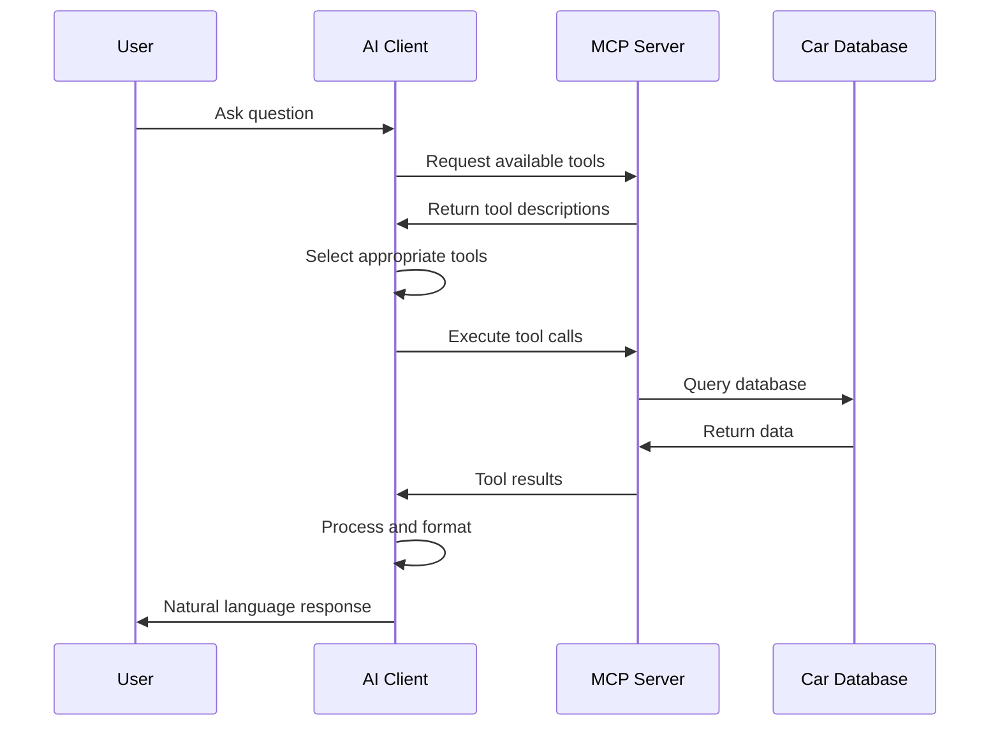

# Components

The MCP Car Database System consists of five main components that work together to provide an intelligent car database interface.

## 🎲 Data Generation (`dataFaker.py`)

Generates synthetic car database with realistic Brazilian car market data.

### Features
- 10 major car brands (Volkswagen, Chevrolet, Fiat, Toyota, etc.)
- Brand-specific models
- Realistic attributes (year, mileage, fuel type, condition)
- Configurable sample size and output format

### Usage
```bash
# Generate 1000 car records
python dataFaker.py 1000

# Custom output file
python dataFaker.py 5000 --output custom_cars.csv

# Smaller dataset for testing
python dataFaker.py 100 --output test_cars.csv
```

### Generated Data Structure

| Column | Description | Example Values |
|--------|-------------|----------------|
| `id` | Unique identifier | UUID4 |
| `brand` | Car brand | VOLKSWAGEN, TOYOTA |
| `model` | Car model | GOL, COROLLA |
| `year` | Manufacturing year | 2000-2025 |
| `engine` | Engine size | 1.0, 1.6, 2.0 |
| `fuel` | Fuel type | FLEX, GASOLINA, HÍBRIDO |
| `color` | Car color | Various colors |
| `mileage` | Kilometers driven | 0-200,000 |
| `number_doors` | Door count | 2, 4, 5 |
| `transmission` | Transmission type | MANUAL, AUTOMÁTICA |
| `condition` | Car condition | NOVO, SEMINOVO, USADO |
| `date_added` | Registration date | Timestamp |

## 🖥️ MCP Server (`MCPserver.py`)

FastMCP-based server providing specialized car database tools.

### Available Tools
- `filter_cars_by_criteria` - Multi-criteria filtering
- `get_car_statistics` - Dataset statistics
- `search_cars_by_keyword` - Keyword search
- `get_available_values` - Column unique values
- `get_column_value_distribution` - Value frequency analysis
- `get_cars_sorted_by` - Sorting operations
- `get_cars_count_by_brand` - Brand counting
- `check_value_exists` - Value existence checking
- `get_grouped_statistics` - Grouped aggregations
- `filter_cars_by_date_range` - Date filtering
- And more...

### Usage
```bash
# Start the server
python MCPserver.py

# Test with web UI
uv run mcp dev MCPserver.py
```

## 🤖 AI Agent Client (`OllamaClient.py`)

Ollama-powered client with MCP tool integration following OpenAI patterns.

### Features
- OpenAI-style tool calling
- Multiple model support
- Interactive and batch modes
- Automatic tool selection and chaining
- Error handling and fallback mechanisms

### Usage

#### Interactive Mode
```bash
python OllamaClient.py --interactive
```

#### Batch Mode
```bash
python OllamaClient.py --output results.md
```

#### Custom Model
```python
async with OllamaClient(model="qwen3-coder:480b-cloud") as client:
    await client.connect_to_server("MCPserver.py")
    response = await client.process_query("Show me all Toyota cars")
```

## 🧪 Testing Framework (`test_questions_tools.py`)

Comprehensive testing suite for evaluating AI model performance with MCP tools.

### Test Categories

1. **Basics** (6 questions)
   - Simple counting and existence checks
   - Direct data retrieval operations

2. **Intermediates** (5 questions)
   - Filtered searches with single criteria
   - Specific attribute queries

3. **Advanced** (2 questions)
   - Statistical operations
   - Dataset summaries

4. **Complex** (7 questions)
   - Multi-step operations
   - Tool chaining requirements

### Usage
```bash
# Test single model
python test_questions_tools.py --model llama3.2

# Compare multiple models
python test_questions_tools.py --compare

# Sample testing (faster)
python test_questions_tools.py --compare --sample 2
```

## 📊 Performance Analysis (`json_to_markdown.py`)

Automated report generation from test results with detailed insights.

### Report Sections
- Executive summary with key metrics
- Model performance comparison table
- Question failure analysis
- Category-wise breakdown
- Detailed insights and recommendations
- Technical appendix

### Usage
```bash
python json_to_markdown.py --input model_comparison_results.json --output report.md
```

### Analysis Metrics
- **Success Rate**: Percentage of correct tool calls
- **Response Time**: Average time per query
- **Tool Usage**: Average tools used per question
- **Error Rate**: Percentage of failed executions
- **Reliability**: Consistency across question types

## Component Interaction



Each component is designed to work independently but integrates seamlessly with the others to provide a complete MCP ecosystem for car database operations.