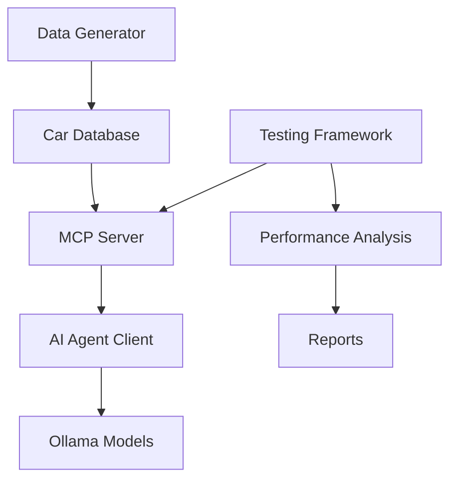

# 🚀 MCP Car Database System

A comprehensive Model Context Protocol (MCP) implementation for car database management with AI agent integration, testing framework, and performance analysis tools.

## 🎯 Overview

This project implements a complete MCP ecosystem for car database operations, featuring:

- **Data Generation**: Synthetic car data creation with realistic attributes
- **MCP Server**: FastMCP-based server with 15+ specialized car database tools
- **AI Agent Client**: Ollama-powered client with tool integration
- **Testing Suite**: Comprehensive test framework with multi-model comparison
- **Performance Analysis**: Automated report generation from test results

## Quick Start

1. **Install Dependencies**
   ```bash
   pip install -r requirements.txt
   ```

2. **Install Ollama Models**
   ```bash
   ollama pull llama3.2:latest
   ollama pull qwen3-coder:480b-cloud
   ```

3. **Generate Sample Data**
   ```bash
   python dataFaker.py 1000
   ```

4. **Start MCP Server**
   ```bash
   python MCPserver.py
   ```

5. **Run Interactive Client**
   ```bash
   python OllamaClient.py --interactive
   ```

## Architecture



## Key Features

- ✅ **Synthetic Data Generation** - Create realistic car datasets
- ✅ **MCP Protocol Implementation** - Full server/client architecture
- ✅ **AI Agent Integration** - Ollama-powered intelligent queries
- ✅ **Comprehensive Testing** - Multi-model performance comparison
- ✅ **Automated Analysis** - Performance reports and insights
- ✅ **Interactive Mode** - Chat-based car database queries
- ✅ **Batch Processing** - Automated query execution

## Next Steps

- [Getting Started](getting-started.md) - Installation and setup
- [Components](components.md) - System components overview
- [Usage Examples](examples.md) - Practical examples
- [Troubleshooting](troubleshooting.md) - Common issues and solutions